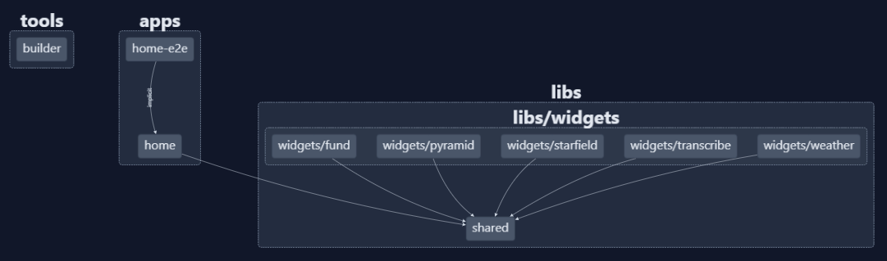
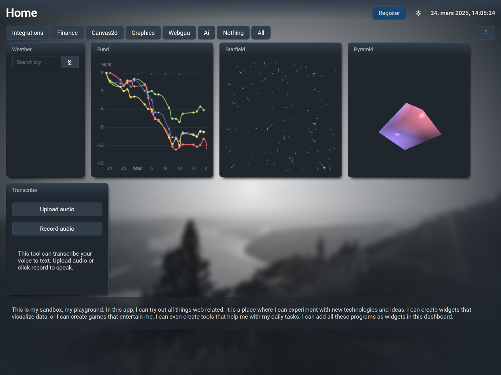

# Home

Dashboard app testing Angular 19 features using custom API from SSR server and lazy-loaded and lazy-rendered components.

The app features:

- BFF [NestJS powered api](./apps/home/server.ts)
- Workbox service-worker built into the dev process (_not [working](https://stackoverflow.com/questions/79374706/how-to-inject-workbox-manifest-in-angular-on-both-build-and-serve-targets) yet_).
- Widget dashboard system where each widget is a self enclosed library with a dashboard view and a fullscreen view.
- Integrations to third parties like met.no for weather data and nordnet.no for financial instrument data.
- Experimentation with canvas and webGPU
- Experimentation with local AI models
- Experimentation with browser api's and best practices on permission handling

This is my feature playground. Nothing useful here, just me playing around.




## How to build and use

This project is built using [`bun`](https://bun.sh/).

```bash
bun install
bun start
```

This will install dependencies and spin up the dev-server.

### Use npm instead

I have heard that some people might have had difficulties in installing dependencies and getting this to run using `npm`. If you do not want to use `bun` for some reason, you might get this to run by

```bash
rm -rf bun.lock
npm install --force
sed -i.bak -e 's/bun x/npx/g' -e 's/bun /npm /g' package.json
```

This will remove the bun lockfile, install dependencies using npm and lastly replace all usage of `bun` in `package.json` with the `npm` equivalent.

### Whisper widget prerequisites (Windows)

```cmd
winget install --id Python.Python.3.11
python -m pip install --upgrade pip
pip install faster-whisper
python -c "from faster_whisper import WhisperModel; WhisperModel('NbAiLab/nb-whisper-small', device='cpu', compute_type='int8')"
```

This installs python and loads up the whisper ai model. After this, `bun start` will be able to handle audio inputs from the client and transcribe it. Currently only transcribing in norwegian, and it will try to translate any audio.
