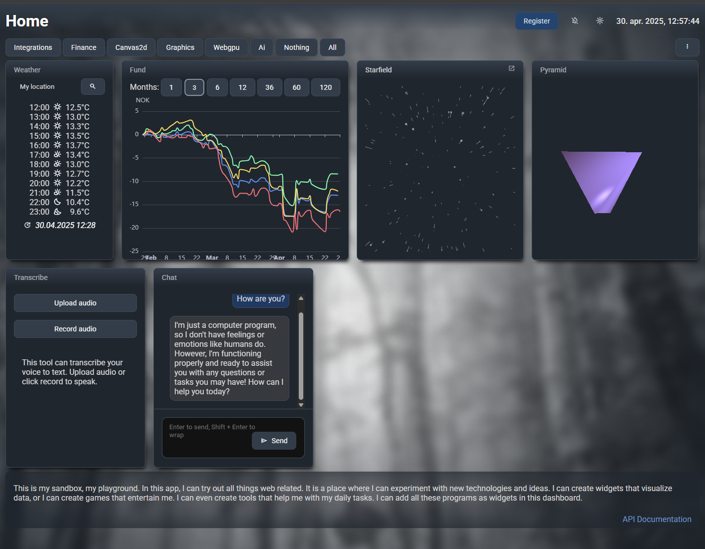
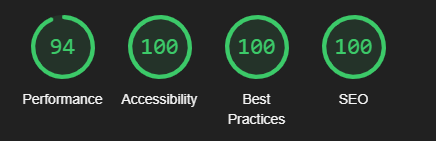

# Home

This repository is a proof of concept playground for building a full-stack application with Angular and NestJS. It demonstrates setting up Angular SSR with a NestJS-powered backend, integrating a database, configuring a reverse proxy, and generating Swagger API documentation. The frontend is a fully installable PWA with a custom service worker that supports continuous builds during development. Perfect for exploring modern web development techniques and best practices.

## Features

- [Full-stack Angular + NestJS + SQLite database](#backend-for-frontend) executed using angular SSR.
- [Workbox service-worker](#service-worker) integrated into the development process
- [Browser API experimentation and permission handling best practices](#utilities)
- Push notifications
- Offline detection
- [Dark/Light mode styling](./apps/dash/src/styles/_variables.scss) with modern css functions
- View transitions
- [Widget dashboard system](#dashboard-system) where each widget is a [self-contained library](./libs/widgets/) with both dashboard and fullscreen views:
  - [Third-party integrations](#integrations) like met.no (weather data) and nordnet.no (financial data)
  - Canvas and WebGPU experiments
  - [Local AI model experimentation](#transcription-service)

This is a personal feature playground. It is not intended for production use.




## How to Build and Run

This project uses [`bun`](https://bun.sh/) for dependency management and development.

```bash
bun install
bun start
```

This installs dependencies and starts the development server. You can also start the backend and frontend separately:

```bash
# in one shell:
bun run dash-api
# and in another shell
bun run dash
```

### Using npm Instead

If you encounter issues with `bun` or prefer `npm`, you can try the following:

```bash
rm -rf bun.lock
npm install --force
sed -i.bak -e 's/bun x/npx/g' -e 's/bun /npm /g' package.json
```

This removes the `bun` lockfile, installs dependencies with `npm`, and replaces `bun` commands in `package.json` with their `npm` equivalents.

### Troubleshooting

- **Launching VSCode chrome debugger prints errors in the console:**
  VSCode launches chrome using the Default profile instead of your regular profile. This has a weird access to the browser cache storage, which does not allow the service worker to pre-cache our resources. Open the url in a "normal" browser profile to get all service worker functionality

## Backend for Frontend

Angular supports using an Express HTTP server for server-side rendering (SSR). This project extends that capability by integrating NestJS as a backend framework.

In [server.ts](./apps/dash/server.ts), a `NestExpressApplication` is created:

```typescript
const app = await NestFactory.create<NestExpressApplication>(ApiModule);
```

The Express instance is retrieved:

```typescript
const server = app.getHttpAdapter().getInstance();
```

This instance is required by `AngularNodeAppEngine` for SSR:

```typescript
const angularNodeAppEngine = new AngularNodeAppEngine();
server.use('*splat', (req, res, next) => {
  angularNodeAppEngine
    .handle(req, {
      server: 'express',
      request: req,
      response: res,
      cookies: req.headers.cookie,
    })
    .then((response) => {
      return response
        ? // If the Angular app returned a response, write it to the Express response
          writeResponseToNodeResponse(response, res)
        : // If not, this is not an Angular route, so continue to the next middleware
          next();
    })
    .catch(next);
});
```

Finally, the NestJS application is initialized:

```typescript
app.init();
```

You would also need to expose the request handler so that the angular app engine can properly work:

```typescript
export const reqHandler = createNodeRequestHandler(server);
```

This produces an environment which has an api, a database and a frontend fully built and served by angular SSR. If served through the production ready docker image, it also gives a nice lighthouse score:


> [!NOTE]  
> The Angular SSR process is used as Express middleware. This could potentially be moved into a `NestMiddleware` for further experimentation.

### Database

Entities are autodetected using the `.forFeature` function in `TypeOrmModule`

```typescript
@Module({
  imports: [
    MyModule,
    TypeOrmModule.forRoot({
      type: 'sqlite',
      database: resolve(process.cwd(), 'db', 'home.db'),
      autoLoadEntities: true,
      synchronize: true,
      logging: true,
    }),
  ],
})
export class ApiModule {}
```

Then include entities in your sub modules:

```typescript
@Module({
  imports: [TypeOrmModule.forFeature([MyEntity])],
  ...
})
export class MyModule {}
```

## Service Worker

This app is a PWA, requiring a [web manifest](./apps/dash/public/manifest.webmanifest) and a [service worker script](./apps/dash/src/sw.ts) registered at [startup](./libs/shared/src/lib/browser/service-worker/service-worker.ts).

One of the things a service worker does is preloading and caching static resources like JavaScript, CSS, and `index.html` in the client. Angular's built-in [ngsw](https://angular.dev/ecosystem/service-workers/config) generates a generic service worker at build time. However, for more control, this project uses [WorkBox](https://developer.chrome.com/docs/workbox). But WorkBox is not quite compatible with Angulars build process yet.

### Challenges with Angular Builds

- **Production Builds (`nx build`)**: Static files are available in the `dist` folder, making it straightforward to generate a pre-cache list.
- **Development Builds (`ng serve`)**: Files are built and served in memory, so the `dist` folder is unavailable.

### Solution

This project uses two custom plugins:

1. [**Custom esbuild plugin**](./apps/dash/builders/custom-esbuild.ts): Runs during `nx serve` to hook into esbuild's `onEnd` event. It generates a partial pre-cache list but cannot include CSS files.
2. [**Custom webpack plugin**](./apps/dash/builders/webpack.config.js): Runs during `nx build` to generate a complete pre-cache list from files written to disk.

The esbuild plugin is configured in [project.json](./apps/dash/project.json):

```json
  "targets": {
    "build": {
      "executor": "@nx/angular:application",
      "options": {
        "plugins": ["apps/dash/builders/custom-esbuild.ts"],
```

For production builds, the pre-cache is overwritten using:

```bash
nx build
bun x webpack --config ./apps/dash/builders/webpack.config.js
```

This ensures an active service worker during both development and production, enabling testing of service worker-specific code without requiring production builds.

## Utilities

This repository includes reusable utilities. Feel free to use anything you find helpful.

### Browser API Helpers

- [Connectivity](./libs/shared/src/lib/browser/connectivity/connectivity.service.ts): Monitors offline/online status
- [GeoLocation](./libs/shared/src/lib/browser/geo-location/geo-location.service.ts): Tracks device latitude/longitude (_requires permission_)
- [Notification](./libs/shared/src/lib/browser/notification/notification.service.ts): Enables push notifications (_requires permission_)
- [ResizeObserver Directive](./libs/shared/src/lib/browser/resize/resize.directive.ts): Observes DOM element size changes
- [Service Worker Initializer](./libs/shared/src/lib/browser/service-worker/service-worker.ts)
- [LocalStorage Abstraction](./libs/shared/src/lib/browser/storage/storage.service.ts): Stores complex JSON structures in `localStorage`
- [Theme Service](./libs/shared/src/lib/browser/theme/theme.service.ts): Manages dark/light mode using [CSS variables](./apps/dash/src/styles/_variables.scss)
- [Active Tab Listener](./libs/shared/src/lib/browser/visibility/visibility.service.ts): Detects if the browser tab is active, helping optimize background tasks

### rxjs Utilities

- [Cache](./libs/shared/src/lib/rxjs/cache.ts) operator: Caches observable results for reuse across subscribers

### Other

- [Color Manipulation](./libs/shared/src/lib/utils/color.ts)
- [Cookie Management](./libs/shared/src/lib/utils/cookie.ts)
- [Debounce](./libs/shared/src/lib/utils/debounce.ts): Includes a function and decorator
- [Number Utilities](./libs/shared/src/lib/utils/numbers.ts)
- [Object Utilities](./libs/shared/src/lib/utils/object.ts)
- [String Manipulation](./libs/shared/src/lib/utils/string.ts): Includes a [pipe](./libs/shared/src/lib/pipes/string.pipe.ts) for templates
- [View Transition Helper](./libs/shared/src/lib/utils/transitions.ts): Simplifies view transition animations

## Dashboard System

This app features a dashboard of mini-applications (widgets), each lazily loaded. While individual routes can use Angular's `loadChildren`, displaying multiple widgets in a single view (dashboard) requires additional logic.

The [dashboard view](./apps/dash/src/app/views/dashboard/) uses a [widget-loader](./libs/shared/src/lib/widget/widget-loader.component.ts) to load widgets dynamically. Widgets are only loaded when instructed, minimizing client-side resource usage.

The [widget service](./libs/shared/src/lib/widget/widget.service.ts) references [widget routes](./libs/widgets/widget.routes.ts) to determine available widgets and their loading mechanisms. The dashboard view fetches a configuration from the backend (an array of widget names) and creates one widget-loader per widget. This approach also supports fullscreen widget routes.

This system allows for multiple dashboard configurations tailored to different needs.

## Widgets

### Integrations

Third-party integrations use a [reverse proxy](./apps/dash/proxy.routes.ts) configured in the [SSR Express server](./apps/dash/server.ts):

```typescript
import { createProxyMiddleware } from 'http-proxy-middleware';
import { proxyRoutes } from './proxy.routes';

Object.entries(proxyRoutes).forEach(([path, config]) => {
  server.use(path, createProxyMiddleware(config));
});
```

Two widgets demonstrate integrations with third-party apis:

- [Weather](./libs/widgets/weather/) - integrates with https://api.met.no/weatherapi
- [Fund](./libs/widgets/fund/) - integrates with [https://public.nordnet.no](https://www.nordnet.se/externalapi/docs/api)

### Canvas and WebGPU Experiments

Two widgets demonstrate canvas and WebGPU effects:

- [Starfield Animation](./libs/widgets/starfield/) - uses 2d canvas
- [Rotating Pyramid](./libs/widgets/pyramid/) - uses [WebGPU](https://developer.mozilla.org/en-US/docs/Web/API/WebGPU_API)

These are simple experiments to explore some new (for me) technologies and techniques.

### Transcription Service

A transcription widget uses AI to convert audio to text. To set it up:

```cmd
winget install --id Python.Python.3.11
python -m pip install --upgrade pip
pip install faster-whisper
python -c "from faster_whisper import WhisperModel; WhisperModel('NbAiLab/nb-whisper-small', device='cpu', compute_type='int8')"
```

This installs Python and the [Whisper AI](https://openai.com/index/whisper/) [model](https://huggingface.co/NbAiLab/nb-whisper-small-beta). After setup, `bun start` enables audio transcription (currently Norwegian only).

The transcription process involves:

1. A [Python script](./apps/whisper/transcribe.py) for transcription
2. A [backend controller](./apps/backend/src/app/transcribe/transcribe.controller.ts) to handle file uploads
3. A [widget](./libs/widgets/transcribe/) for audio input - via microphone (_requires permission_) or file upload

### WebLLM

The [WebLLM](https://webllm.mlc.ai/) [chat experiment](./libs/widgets/chat/) loads and runs a language model entirely in the browser. This utilizes WebGPU for performance. There are small models which could be cheap to run on low performance graphics systems, but here I'm using a medium model which performs best on high-performance GPU's like nvidia or amd. It can be a bit sluggish on low-end GPU's like intel.

Most systems have more than one GPU on their system. One integrated on the motherboard and a second more powerful GPU mounted as an expansion card. The integrated one will on most systems struggle a bit to run the selected model here, so for best performance - open your OS graphics settings, select advanced settings, choose your browser and enable "High-performance" graphics processor for that program.
