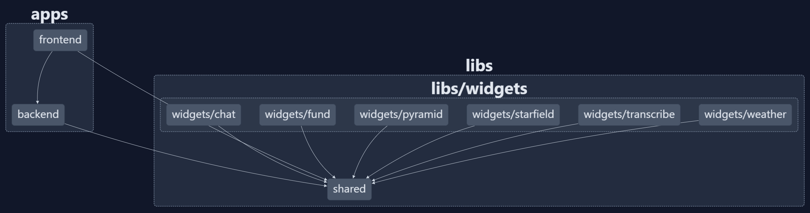

# Home

Dashboard app testing Angular 19 features using custom API from SSR server and lazy-loaded and lazy-rendered components.

The app features:

- [BFF - NestJS powered api](#backend-for-frontend)
- [Workbox service-worker](#service-worker) built into the dev process.
- [Experimentation with browser api's and best practices on permission handling](#utilities)
- [Widget dashboard](#dashboard-system) system where each widget is a [self enclosed library](./libs/widgets/) with a dashboard view and a fullscreen view.
  - [Integrations to third parties](#integrations) like met.no for weather data and nordnet.no for financial instrument data.
  - Experimentation with canvas and webGPU
  - [Experimentation with local AI models](#transcription-service)

This is my feature playground. Nothing useful here, just me playing around.




## How to build and use

This project is built using [`bun`](https://bun.sh/).

```bash
bun install
bun start
```

This will install dependencies and spin up the dev-server.

### Use npm instead

I have heard that some people might have had difficulties in installing dependencies and getting this to run using `npm`. If you do not want to use `bun` for some reason, you might get this to run by

```bash
rm -rf bun.lock
npm install --force
sed -i.bak -e 's/bun x/npx/g' -e 's/bun /npm /g' package.json
```

This will remove the bun lockfile, install dependencies using npm and lastly replace all usage of `bun` in `package.json` with the `npm` equivalent.

## Backend for frontend

Angular now allows the use of a express http server for its server side rendering. By utilizing this, we can extend the capabilities here by also introducing a backend framework like NestJS. This is how I do it:

In [server.ts](./apps/frontend/server.ts) I first setup a NestExpressApplication

```typescript
const app = await NestFactory.create<NestExpressApplication>(ApiModule);
```

This creates the nest application with my [main module](./apps/backend/src/api.module.ts).

I then get the express instance:

```typescript
const server = app.getHttpAdapter().getInstance();
```

which the `AngularNodeAppEngine` requires for server-side rendering.

```typescript
const angularNodeAppEngine = new AngularNodeAppEngine();
server.use('*splat', (req, res, next) => {
  angularNodeAppEngine
    .handle(req, {
      server: 'express',
      request: req,
      response: res,
      cookies: req.headers.cookie,
    })
    .then((response) => {
      // If the Angular app returned a response, write it to the Express response
      if (response) {
        return writeResponseToNodeResponse(response, res);
      }
      // If not, this is not an Angular route, so continue to the next middleware
      return next();
    })
    .catch(next);
});
```

Then lastly, after I'm done configuring express with anything that cannot or should not be done in Nest, I initialize my NestJS application

```typescript
app.init();
```

Angular SSR process is here used as an express middleware, which NestJS has support for. So I could probably move the entire rendering process inside a `NestMiddleware`. I will probably experiment with this later.

## Service-worker

This app is a PWA. Which means that it needs a [web manifest](./apps/frontend/public/manifest.webmanifest) and a [javascript file](./apps/frontend/src/sw.ts) which is loaded and registered on startup.

One of the main things a service-worker does, is it instructs the browser to pre-load and cache all the static resources of your app - like javascript, css and other files (the most important being your `index.html`).

Angular has its built in [ngsw](https://angular.dev/ecosystem/service-workers/config), which generates a generic service-worker build time. This is fine in simple cases, but if you want to have more control, you will want to roll your own. Google has [WorkBox](https://developer.chrome.com/docs/workbox), a "framework" for building service-workers which is excellent.

When angular builds using ngsw, it knows about all the artifacts it builds and can give these to their sw generator to properly pre-cache the app - and it does so on both build and serve. But
angular does not expose anything yet which can hook into the proper place in the build process to retrieve all artifacts.

This is no problem when running a production build (`nx build`). All you have to do then is to loop through the files in the `dist` folder of your app to build this list, but when you want to `ng serve` your app locally - _like you often do when you are developing_ - the dist folder is not present because angular now builds and serves the files in memory.

This repo tries to solve this by using 2 things to do build the service-worker pre-cache:

- [A custom esbuild plugin](./apps/frontend/builders/custom-esbuild.ts) which runs on `nx serve` and tries to hook into esbuild's `onEnd` hook. But angular uses both esbuild and vite to build, and esbuild only bundles the javascript. So I get the bundles here, but nothing else. I try to loop through what is known and generate a pre-cache regardless, but I cannot get the generated css here.
- [A custom webpack plugin](./apps/frontend/builders/webpack.config.js) which runs on `nx build` and properly creates the precache based on files actually outputted to disk.

The first is given to esbuild by using the [nx application executor](./apps/frontend/project.json) for our builds:

```json
  "targets": {
    "build": {
      "executor": "@nx/angular:application",
      "options": {
        "plugins": ["apps/frontend/builders/custom-esbuild.ts"],
```

Which actually means that it runs both on build and on serve, but for `nx build` I overwrite the results with the proper pre-cache. This is done using a separate script:

```bash
nx build
bun x webpack --config ./apps/frontend/builders/webpack.config.js
```

So angular builds first, then I run the `workbox-build.injectManifest` after.

The most important thing here, is that I have an active and working service-worker on both build and serve, which allows me to test out service-worker specific code without having to prod build every single time.

## Utilities

This repo contains several generic utilities which are great for reuse. If you find anything useful here, feel free to steal anything you like.

- [Browser api helpers](./libs/shared/src/lib/browser/)
  - [Connectivity](./libs/shared/src/lib/browser/connectivity/connectivity.service.ts) listens for change in offline/online status
  - [GeoLocation](./libs/shared/src/lib/browser/geo-location/geo-location.service.ts) listens for device latitude/longitude (_Permission required_)
  - [Notification](./libs/shared/src/lib/browser/notification/notification.service.ts) allows for push notifications (_Permission required_)
  - [Directive for ResizeObserver](./libs/shared/src/lib/browser/resize/resize.directive.ts) gives programmatic support for observing the size of DOM elements
  - [Service worker initializer](./libs/shared/src/lib/browser/service-worker/service-worker.ts)
  - [Localstorage abstraction](./libs/shared/src/lib/browser/storage/storage.service.ts) allows storing complex json structures in localStorage
  - [Theme (Dark/Light mode) service](./libs/shared/src/lib/browser/theme/theme.service.ts) manages user selected theme. Together with modern [CSS variables](./apps/frontend/src/styles/_variables.scss) this is golden.
  - [Active browser tab listener](./libs/shared/src/lib/browser/visibility/visibility.service.ts) reports if the apps browser tab is active and visible or not. Can help pause background stuff when user is not active in the tab. This ultimately saves CPU cycles and memory consumption.
- [rxjs](./libs/shared/src/lib/rxjs/)
  - A [cache observable operator](./libs/shared/src/lib/rxjs/cache.ts) which caches the results of an observable and reuses it for all other subscribers. I have previously setup a http interceptor for this, but that will only cache http calls. This is more flexible in that it can cache the result of any observable you give it.
- [Other utilities](./libs/shared/src/lib/utils/)
  - [Color manipulation](./libs/shared/src/lib/utils/color.ts) utilities
  - [Cookie management](./libs/shared/src/lib/utils/cookie.ts)
  - [Debounce](./libs/shared/src/lib/utils/debounce.ts) function and decorator
  - [Number utilities](./libs/shared/src/lib/utils/numbers.ts)
  - [Object utilities](./libs/shared/src/lib/utils/object.ts) and helpers
  - [String manipulation](./libs/shared/src/lib/utils/string.ts). Also includes a [pipe](./libs/shared/src/lib/pipes/string.pipe.ts) for string manipulation in the template.
  - [View transition](./libs/shared/src/lib/utils/transitions.ts) helper to minimize boilerplate when starting view transition animations.

## Dashboard system

I wanted to make a dashboard of mini-applications. Each mini-application (widget) should be lazily loaded. For individual routes, this is easy using angular and the `loadChildren` route config. But when the widgets should be displayed in a single view, like a dashboard, it becomes a bit more tricky.

We have a [dashboard view](./apps/frontend/src/app/views/dashboard/) and we use a [widget-loader](./libs/shared/src/lib/widget/widget-loader.component.ts) to load in our widgets at runtime. So widgets are only loaded when something in the dashboard instructs the widget loader to do so. This means that you can create an endless portfolio of widgets, but they take up no space on the client before the client is instructed to show them.

Our [widget service](./libs/shared/src/lib/widget/widget.service.ts) uses the [widget-routes](./libs/widgets/widget.routes.ts) as a repository of which widget names are available and how to load them. The dashboard view asks the backend for a dashboard configuration, which is basically an array of widget names to display. When this is received, the dashboard view creates one widget-loader per widget name, and the loader takes care of loading the code, creating the component dynamically and render it in the dashboard viewport. And since the widget repository is also a route configuration, we can use this to create routes to show our widgets in fullscreen.

This opens up for the possibility to have several different dashboard configurations depending on your need. We could for instance have a dashboard driven application where we have multiple levels of information and each level required different kinds of widgets.

## Widgets

### Integrations

The integrations don't have a local backend. They use a [reverse proxy](./apps/frontend/proxy.routes.ts) to forward calls from the client. The reverse proxy is setup in our [SSR express server](./apps/frontend/server.ts) like this:

```typescript
import { createProxyMiddleware } from 'http-proxy-middleware';
import { proxyRoutes } from './proxy.routes';

Object.entries(proxyRoutes).forEach(([path, config]) => {
  server.use(path, createProxyMiddleware(config));
});
```

### Canvas and webGPU experiments

I have two widgets where I experiment with some effects in canvas with both 2d context and webgpu contexts.

One is a [starfield animation](./libs/widgets/starfield/), the other is just a [rotating pyramid](./libs/widgets/pyramid/). Nothing groundbreaking here, I just wanted to teach myself some new (for me) technologies and techniques.

### Transcription service

One of the widgets here use a transcription AI translating audio to text. In order to use this, you will need to install some prerequisites:

```cmd
winget install --id Python.Python.3.11
python -m pip install --upgrade pip
pip install faster-whisper
python -c "from faster_whisper import WhisperModel; WhisperModel('NbAiLab/nb-whisper-small', device='cpu', compute_type='int8')"
```

This installs python and loads up the whisper ai model. After this, `bun start` will be able to handle audio inputs from the client and transcribe it. Currently only transcribing in norwegian, and it will try to translate any audio.

The transcribing is done by a [python script](./apps/whisper/transcribe.py), which is instantiated by our [backend controller](./apps/backend/src/app/transcribe/transcribe.controller.ts), which is invoked by a file upload from the [widget](./libs/widgets/transcribe/). The widget can either upload a recording by accessing the users microphone (_permission required_), or upload an audio file.
